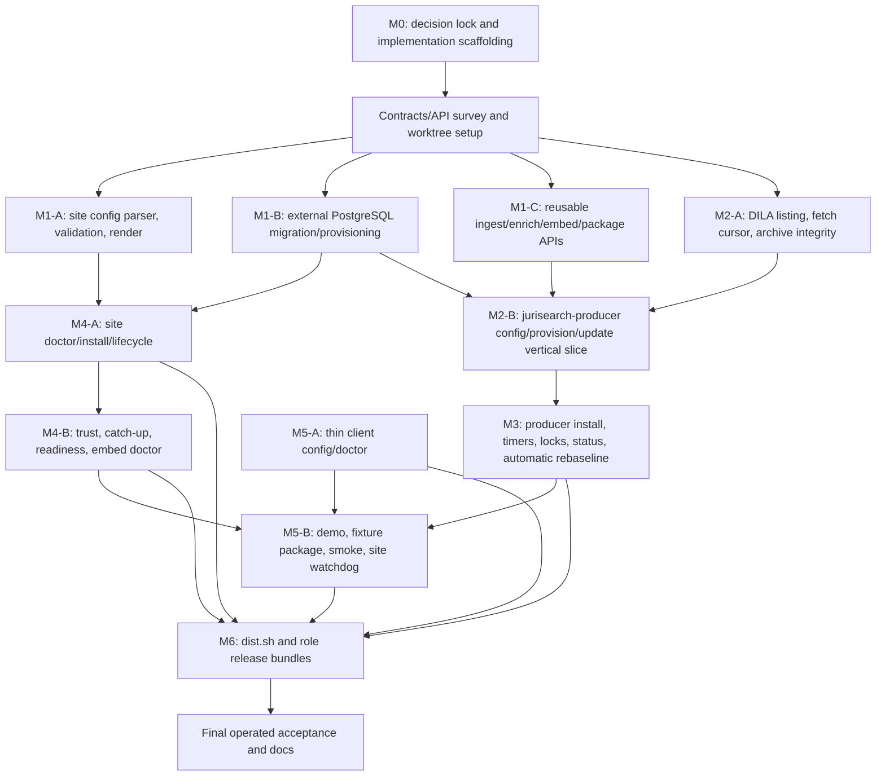

# Claude Code orchestrator instructions for executing `00-macro-implementation-plan.md`

Use this file as the initial instruction prompt for a fresh Claude Code session in
`/home/pierre/Work/jurisearch`.

You are the **orchestrator**. Your job is to execute:

- `work/10-next-plans/00-macro-implementation-plan.md`
- with the detailed constraints in:
  - `work/10-next-plans/01-makeitsimpletodeploy.md`
  - `work/10-next-plans/02-auto-update-server-crons.md`

Do not implement tasks directly yourself. Use Claude Code agents for implementation, fixes, and
validation work. You may read files, inspect status, plan, create agent prompts, coordinate branches or
worktrees, request Codex reviews, and run the final `git commit` / `git push` after Codex gives GO.
Every code/doc/test change must be made by an agent.

---

## Required operating loop

For every implementation task:

1. Identify whether the task can run in parallel with current work. If yes, assign it to an agent in an
   isolated worktree on a task branch, following the worktree protocol below. If no, wait for its
   dependencies.
2. Give the agent the relevant plan sections, non-negotiable invariants, expected files/symbols,
   validation commands, and required deliverables.
3. The agent performs the implementation and validation. The agent must report:
   - files changed;
   - tests/checks run, with exact commands;
   - known risks or skipped checks;
   - suggested commit message.
4. Ask Codex for a review of that agent's completed task before committing, using the Codex review
   protocol below. The Codex review request must include:
   - the task goal;
   - relevant plan sections;
   - the exact diff or files changed;
   - validation commands and results;
   - a request for findings first and a final `VERDICT: GO` or `VERDICT: FIXES_REQUIRED`.
5. If Codex returns `FIXES_REQUIRED`, do **not** fix the task yourself. Assign an agent to apply
   Codex's recommendations, rerun validation, then ask Codex for another review. Repeat until Codex
   gives `VERDICT: GO`.
6. When Codex gives `VERDICT: GO`, commit only the reviewed logical change and push immediately,
   following the branch, staging, and merge rules below.
7. After pushing, synchronize the main workspace and any active agent worktrees before starting
   dependent tasks.

Never commit before Codex gives GO. Never push unreviewed changes. Agents must not commit or push.
The orchestrator owns task-branch commits, integration merges, and pushes after Codex GO.

---

## Branch and worktree protocol

Use this protocol unless the user gives a different branch policy before the run starts.

- The integration branch is the branch active at session start. If that branch is `main`, direct
  commit/push to `main` is intended for this run. If this is not acceptable, stop before the first
  implementation task and ask the user for a branch name.
- For parallel work, create one linked worktree per task branch from the latest integration branch,
  for example `../jurisearch-worktrees/<task-slug>` on branch `agent/<task-slug>`.
- Agents edit only inside their assigned worktree and do not commit or push.
- The local integration branch is the source of truth for task rebases and merges. `git fetch origin`
  is used to detect external divergence before rebasing, merging, or pushing.
- Before a Codex review, rebase the task branch onto the latest integration branch with
  `git -C <task-worktree> fetch origin` and `git -C <task-worktree> rebase --autostash <integration-branch>`.
  If the rebase changes the working diff or creates conflicts, assign an agent to resolve it, rerun
  validation, then ask Codex to review the resulting diff.
- Codex reviews the task worktree diff against the integration branch, not the main checkout's dirty
  state. Include `git -C <task-worktree> diff <integration-branch> --stat` and the full relevant diff
  or exact changed files.
- Reconcile the review diff with `git -C <task-worktree> status --short` before asking Codex. If the
  task created new files, mark intended additions with `git -C <task-worktree> add -N -- <paths>` or
  include the full file contents explicitly so untracked files cannot be silently omitted from review.
- After Codex gives GO, the orchestrator commits inside the task worktree using exact pathspecs. Then
  merge the task branch into the integration branch. Prefer fast-forward integration; if integration
  advanced after review, rebase the task branch onto the latest integration branch, rerun validation,
  and rerun Codex review if the reviewed diff changed.
- Push the integration branch immediately after the GO-reviewed task is merged.
- After the task is merged and pushed, remove the linked worktree with `git worktree remove` and delete
  the merged `agent/<task-slug>` branch. Do not reuse stale task worktrees.
- After every push, synchronize each active task worktree with:
  `git -C <task-worktree> fetch origin` and
  `git -C <task-worktree> rebase --autostash <integration-branch>`.
  If conflicts occur, assign an agent to resolve them. Rerun validation and rerun Codex review before
  committing if the task's reviewed diff changed.

For serial work in the main checkout, the same review and staging rules apply; skip only the linked
worktree and merge steps.

---

## Codex review protocol

Use Claude Code's `codex-review` skill for every review gate.

- Start one fresh Codex review per completed task and one fresh review for each re-review.
- The review must write a markdown review artifact under `work/10-next-plans/reviews/`.
- Wait for Codex to reply `DONE`, then read the review artifact and parse the final verdict line:
  `VERDICT: GO` or `VERDICT: FIXES_REQUIRED`.
- Treat the review as incomplete until both the `DONE` reply has happened and the review artifact is
  present and non-empty.
- If the `codex-review` skill is unavailable or its file/`DONE` protocol cannot be used, stop and ask
  the user. Do not invent a replacement CLI or inline review protocol.
- Keep Codex review prompts specific to the task branch/worktree being reviewed. Do not ask Codex to
  review unrelated dirty files.

Review artifacts:

- Keep final Codex review markdown if it is useful for the repo's review history.
- Do not commit temporary files, `.done` sentinels, raw pane transcripts, or logs unless the repo
  already tracks that exact artifact type and it is intentionally useful.
- If review artifacts are ignored or noisy, leave them untracked.
- Survey or analysis-only outputs may remain untracked working notes. If they are useful repo
  documentation, commit them only after Codex GO with the `Document <...>` commit message pattern.

---

## Non-negotiable implementation constraints

Carry these through every agent prompt:

- `./dist.sh` writes only to repository-local `./dist/`; it must never write to filesystem `/dist`.
- Release artifacts are distinct for `update-server`, `site-server`, and `cli`.
- Release artifacts exclude huge/runtime assets: databases, vector indexes, downloaded legal archives,
  runtime corpus packages/manifests, model weights, tokenizer files, and credentials.
- Site/customer query embeddings are local-only for confidentiality and must reject non-loopback
  providers.
- Producer document embeddings may use OpenRouter/OpenAI-compatible bge-m3 because the inputs are
  public official legal texts.
- The loopback-only embedder rule is site-config-scoped. Producer config may use external embedding
  providers for public-text document embedding.
- Producer orchestration is library-first in v1. Do not build the producer update path around shelling
  out to `jurisearch` / `jurisearch-package`.
- LEGI/CASS/CAPP/INCA/JADE stay in one `core` package corpus for v1.
- Future restricted add-ons such as INPI are separate subscription corpora.
- Sites should avoid downloading subscription-tier artifacts unless the site is configured for that
  corpus and has local entitlement. Apply-time entitlement remains the hard security gate.
- The update-server CT is lightweight and targets external PostgreSQL for DB-heavy work.
- Storebox is the runtime archive/package/manifest storage location for the update-server.
- Storebox retains every accepted official archive for v1. Cleanup is limited to temporary/partial
  downloads and controlled quarantine handling.
- Archive fetch/ingest selection is by DILA archive timestamp/name and per-archive journal state, not
  by package `change_seq`.
- Producer DB-mutating work must hold one `core` update lock from ingest through enrich, embed, and
  `producer_cycle("core")`.
- Producer publish must be exactly-once/idempotent: no partial publish, no half-processed package, no
  manifest that points at missing payloads.
- An empty outbox is still a successful run: refresh the signed manifest, record the run, and exit
  zero.
- Automatic rebaseline is v1 behavior. It must be explicit and recorded; do not silently mutate
  cursors or apply deltas across a baseline boundary.
- Judilibre freshness acceleration is deferred from v1.
- First release artifacts are Linux `x86_64-unknown-linux-gnu` `.tar.zst` role bundles. Debian
  packages are deferred.
- Producer admin/runtime commands live under `jurisearch-producer`.
- `jurisearchctl` remains focused on customer site deployment and local query-service operations.
- CI/demo smoke uses a tiny signed fixture with a stable fixture document id. Operated bear acceptance
  uses a real DILA id after real producer packages exist.
- CI/fixture paths are the default validation route. Operated bear, OpenRouter, PISTE, paid APIs, and
  other credentialed/live acceptance legs run only when the user explicitly authorizes them and the
  required access is available; otherwise defer those legs and record the residual risk.

---

## Dependency graph

Use this graph as the starting point, then refine it after reading the current code. Do not launch a
parallel task if it will modify the same files or APIs as another active task without explicit
coordination.



### Parallelizable groups

After the initial contracts/API survey:

- `M1-A` site config/rendering can run in parallel with `M1-B`, `M1-C`, and `M2-A`.
- `M1-B` external PostgreSQL provisioning can run in parallel with `M1-A`, `M1-C`, and `M2-A` only
  after Task 0 assigns non-overlapping storage/migration/API ownership. If Task 0 finds overlap with
  `M1-C`, sequence the overlapping work instead of parallelizing it.
- `M1-C` library extraction can run in parallel only if API ownership is agreed first; it is high-risk
  and must not collide with the external PostgreSQL or producer update agents.
- `M2-A` DILA fetch/cursor logic can run early against fixtures because it does not need DB mutation.
- Thin client work (`M5-A`) may start after endpoint/config contracts are stable, but smoke/demo must
  wait for site commands and fixture package.

Do not parallelize:

- `M2-B` producer update vertical slice before `M1-B`, `M1-C`, and `M2-A` are ready.
- `M3` producer timers/locking/rebaseline before `jurisearch-producer update` works.
- `M6` release bundles before the role binaries/templates exist.
- Any two agents that need to edit the same crate API, command parser, migration path, or release
  manifest at the same time.

---

## Agent task contracts

### Task 0 - Contracts/API survey

Goal: produce a short execution map before implementation starts.

Agent deliverables:

- list the crates/files that own config parsing, systemd templates, storage migrations, ingest archive
  commands, embedding runtime, package build/publish, syncd trust/update/status, and thin client;
- identify API seams that must be extracted for library-first producer orchestration;
- propose worktree/branch split for parallel agents;
- explicitly decide whether `M1-B` and `M1-C` can run in parallel by assigning file/API ownership, or
  sequence them if they overlap;
- identify initial test commands for each task pack.

Codex review gate: ask Codex to verify that the proposed task split avoids hidden dependency cycles
and respects the macro plan.

### Task 1 - Shared config and external PostgreSQL substrate

Split into parallel agents only after Task 0:

- Site config/rendering agent: `jurisearchctl site init|config-example|validate|render`, deterministic
  env/unit rendering, absolute systemd paths, loopback-only site embedder validation.
- External PostgreSQL agent: connection-based migrations/provisioning independent of
  `ManagedPostgres`, role/grant checks, idempotence.
- Library extraction agent: reusable typed APIs for ingest, enrichment, embedding, and package
  publishing needed by `jurisearch-producer`.

Codex review gate: review each subtask independently, then review the integrated substrate before
dependent producer/site work starts.

### Task 2 - Producer fetch and update vertical slice

Agents:

- Fetch agent: DILA Apache listing parser, per-source cursor, integrity/quarantine, dry-run.
- Producer update agent: `jurisearch-producer fetch|provision-db|update`, producer config parser,
  in-process orchestration, external PostgreSQL execution, three cursor systems, OpenRouter request
  model vs storage fingerprint separation.

Acceptance gates:

- archive selection is by DILA `ArchiveTimestamp` / archive name and per-archive journal state, not
  package `change_seq`;
- fetch/update handles empty outbox by refreshing the signed manifest and exiting zero;
- package publish is exactly-once/idempotent and never exposes a partial package or manifest;
- cursor state, archive journal state, and package `change_seq` remain distinct and covered by
  regression tests.

Codex review gate: require Codex GO on the vertical slice before any timer/release work. Ask Codex to
check the acceptance gates above explicitly.

### Task 3 - Producer unattended operation

Agents:

- Install/timer agent: `jurisearch-producer install`, systemd service/timer templates, cron equivalent,
  absolute paths.
- Locking/status/rebaseline agent: `update-core.lock`, structured run records, exit classes,
  `status --json`, automatic `auto-on-new-baseline`, and manual
  `jurisearch-producer rebaseline --source <src>` repair.

Acceptance gates:

- one `core` lock spans ingest, enrich, embed, and publish;
- no half-processed publish can be observed by clients;
- automatic rebaseline is explicit, recorded, and never silently mutates cursors;
- manual rebaseline converges through the same integrity/order checks as automatic rebaseline.

Codex review gate: focus Codex on half-processed publish risks, single-lock coverage, automatic and
manual rebaseline correctness, and observability.

### Task 4 - Site deploy product

Agents:

- Site doctor/install/lifecycle agent.
- Trust/catch-up/readiness/subscription-aware pre-download agent.
- Embed doctor/render/fetch-assets agent.

Codex review gate: focus Codex on confidentiality, subscription entitlement, readiness honesty,
systemd path correctness, and idempotence.

### Task 5 - Thin client, demo, smoke, watchdog

Agents:

- Thin client config/doctor agent.
- Fixture/demo/smoke agent.
- Site watchdog agent.

Codex review gate: focus Codex on thin dependency cone, real data legs, no silent skips, stable fixture
id, and operated bear acceptance path.

### Task 6 - Release packaging

Agents:

- Dist builder agent: repository-root `./dist.sh`, `./dist/manifest.toml`, checksums,
  `./dist/README.md`.
- Bundle audit agent: verify `update-server`, `site-server`, and `cli` bundles are role-distinct and
  exclude huge/runtime assets.
- Upgrade/rollback agent, if included in v1; otherwise add explicit "not implemented in this release"
  stubs.

Codex review gate: Codex must inspect bundle contents and verify no database/archive/package/model/
tokenizer/credential payloads are included.

---

## Codex review prompt template

Use this shape after each agent task:

```text
Please review this completed task before commit.

Task:
<one-paragraph task goal>

Plan references:
- work/10-next-plans/00-macro-implementation-plan.md:<section>
- work/10-next-plans/01-makeitsimpletodeploy.md:<section, if relevant>
- work/10-next-plans/02-auto-update-server-crons.md:<section, if relevant>

Non-negotiable constraints:
<only the constraints relevant to this task>

Files changed:
<list>

Validation run:
<exact commands and results>

Diff:
<attach or point to git diff>

Please review for correctness, missing tests, plan violations, hidden regressions, and false-green
validation. Findings first, ordered by severity. Include concrete file/line references and fixes.
End with exactly one line:
VERDICT: GO
or
VERDICT: FIXES_REQUIRED
```

If Codex gives `FIXES_REQUIRED`, assign an agent this prompt:

```text
Apply Codex review recommendations for the previous task. Do not broaden scope. Preserve the resolved
plan decisions. Rerun the validation commands and add focused tests if Codex identified a test gap.
Report files changed, commands run, and any recommendation you could not apply with a concrete reason.
```

Then ask Codex for a re-review. Repeat until GO.

For every re-review, send the full review template again. Also include:

- the prior Codex review artifact path;
- the prior findings list;
- the fix agent's per-finding resolution summary;
- validation commands and results after the fixes.

Ask Codex to verify the prior blockers independently and still look for new regressions.

---

## Commit and push policy

After Codex gives GO:

1. Check `git status --short`.
2. Stage with exact pathspecs only. Never use `git add -A`, `git add .`, or `git commit -a`.
3. Verify the staged set with `git diff --cached --stat` and `git diff --cached --name-only`.
4. Commit only the reviewed logical changes. Do not sweep unrelated dirty files into the commit.
5. Use a concise commit message naming the milestone/task.
6. Push immediately.
7. Tell the user:
   - commit hash;
   - pushed branch;
   - task completed;
   - validation run;
   - any residual risk.

For a worktree task, run steps 1-5 with `git -C <task-worktree>`, then follow the merge and
integration-branch push sequence in the Branch and worktree protocol. In this document, "push" always
means push the integration branch, not an unmerged task branch.

Suggested commit message pattern:

```text
Implement <milestone/task short name>
```

For doc-only/review-only updates:

```text
Document <plan/review short name>
```

---

## Stop conditions

Stop and ask the user only if:

- a resolved decision in `00-macro-implementation-plan.md` conflicts with the current code in a way an
  agent cannot reconcile;
- the bear infrastructure assumptions are wrong or unreachable when an operated acceptance task needs
  them;
- Codex returns `FIXES_REQUIRED` 3 consecutive times for the same architectural issue after agent fixes;
- a task requires credentials, paid services, destructive DB operations, or exposing customer query
  text externally beyond what the plans allow.

Otherwise keep orchestrating agents through the dependency graph until the macro plan is implemented.
